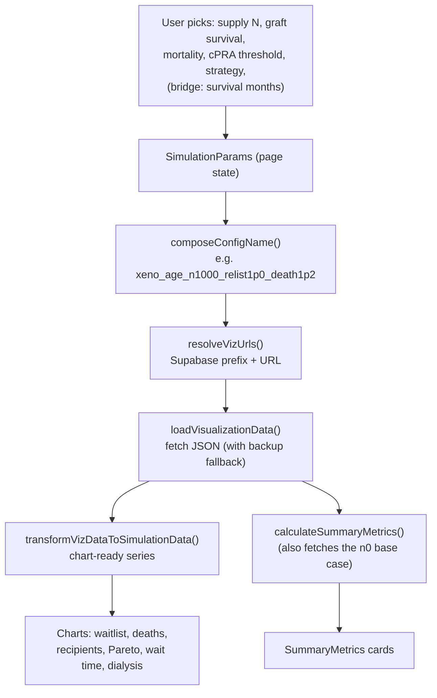

# Xeno Hope Explorer (Frontend)

An interactive dashboard for the xenotransplantation simulation. It lets someone
ask "what if we had N pig kidneys per year, and they worked this well?" and see
the effect on waitlist size, deaths, wait time, and dialysis burden, for both
Replacement and Bridge therapy.

This app does no simulation. It reads pre-computed JSON files from a public
Supabase bucket (produced by the [`xenotransplantation`](../xenotransplantation)
backend) and renders them. The backend README explains the model, the two
regimes, the config naming, and the Supabase layout; this one focuses on how the
UI turns a user's choices into a data fetch and then into charts.

## Contents

1. [Tech stack](#tech-stack)
2. [How a choice becomes a chart](#how-a-choice-becomes-a-chart)
3. [Where the data comes from](#where-the-data-comes-from)
4. [Config naming](#config-naming)
5. [The two pages](#the-two-pages)
6. [The metrics](#the-metrics)
7. [Project structure](#project-structure)
8. [Running locally](#running-locally)
9. [Configuration and feature flags](#configuration-and-feature-flags)
10. [Deployment](#deployment)
11. [Staying in sync with the backend](#staying-in-sync-with-the-backend)

## Tech stack

Vite + React 18 + TypeScript, shadcn-ui (Radix) and Tailwind for the UI, Recharts
for charts, React Router for routing, TanStack Query for the query client, and
Vitest for tests. The dev server runs on port 8080.

## How a choice becomes a chart

Every interaction follows the same path. The user moves a slider or picker, the
page recomputes which JSON to fetch, downloads it from Supabase, transforms it,
and re-renders.



The naming and fetching live in `src/utils/configFinder.ts`; the shaping and
metrics live in `src/utils/dataTransformer.ts`. The pages (`Index.tsx`,
`Bridge.tsx`) wire state to those helpers inside a `useEffect`.

Most charts compare against the base case (`N=0`, no xenografts), so the page
fetches two JSONs: the chosen scenario and the `n0` base for the same strategy
and threshold.

## Where the data comes from

All JSONs come from one public bucket, whose base URL is supplied via the
`VITE_SUPABASE_STORAGE_URL` env var (see `.env.example`):

```
${VITE_SUPABASE_STORAGE_URL}/{prefix}/{configName}.json
# e.g. https://<project-ref>.supabase.co/storage/v1/object/public/viz-data/{prefix}/{configName}.json
```

`resolveVizUrls()` picks the prefix from the mode, cPRA threshold, strategy, and
(for bridge) survival months:

| Mode | Strategy | Threshold | Prefix |
|---|---|---|---|
| Replacement | standard | 95 | `viz_data_age` |
| Replacement | standard | 85 / 99 | `viz_data_age_85` / `viz_data_age_99` |
| Replacement | targeted | 95 / 85 / 99 | `viz_data_age_targeting_95` / `_85` / `viz_data_age_targeting` |
| Bridge | standard | any | `viz_data_age_bridge_{thr}_surv{M}mo` |
| Bridge | targeted | any | `viz_data_age_bridge_targeting_{thr}_surv{M}mo` |

For Replacement there's also a backup prefix (a pre-rerun snapshot).
`loadVisualizationData()` tries the live prefix first and falls back to the
backup if a file 404s during a backend re-run. Bridge has no backup snapshot.

The JSON schema (series, the `mode` tag, `y_std` bands, `num_experiments`) is in
the backend README. A missing `mode` is treated as `"replacement"` for older
files.

## Config naming

The file name encodes the scenario. `composeConfigName()` builds it, and it has
to match the string the backend uploaded or the fetch 404s.

```
{strategyBase}_n{N}_relist{r}p{..}_death{d}p{..}
```

- `n{N}` is absolute supply in kidneys/yr (`supplyToken` in `supplyGrid.ts`).
- `relist{r}` is the graft-survival multiplier. Replacement uses
  `{0.5, 0.8, 1.0, 1.2}`. Bridge hard-codes `1p0` because survival is baked into
  the backend pickle and selected via the prefix instead.
- `death{d}` is the mortality multiplier, `{1.0, 1.2}`.

The base case is special. At `N=0` no xenograft is transplanted, so the
relist/death multipliers don't matter and the backend emits one canonical
`..._n0_relist1p0_death1p0` per (strategy, threshold). The frontend ignores the
relist/death pickers when `N=0` and composes that one name; otherwise it would
request files that don't exist.

The allowed grids are exported constants and have to mirror the backend:

| Constant (`configFinder.ts`) | Values | Backend counterpart |
|---|---|---|
| `XENO_RELIST_MULTIPLIERS` | `0.5, 0.8, 1.0, 1.2` | `RELISTING_MULTIPLIERS` |
| `XENO_DEATH_MULTIPLIERS` | `1.0, 1.2` | `DEATH_MULTIPLIERS` / `BRIDGE_DEATH_MULTIPLIERS` |
| `BRIDGE_SURVIVAL_MONTHS` | `6, 12, 18, 24, 36` | `SURVIVALS` |
| supply points (`supplyGrid.ts`) | per strategy x threshold | `supply_grid.SUPPLY_GRID` |

## The two pages

`/` is Replacement therapy (`src/pages/Index.tsx`), the default view. A xenograft
is a definitive transplant. It has:

- `SimulationControls`: supply, graft survival, post-tx mortality, cPRA threshold
  (85/95/99), targeting strategy.
- `SummaryMetrics`: headline cards (lives saved, wait-time change, dialysis
  burden) vs. the `n0` base.
- `SimulationCharts`: waitlist size, recipients, cumulative deaths by bucket,
  deaths/year, with confidence bands.
- `ReplacementPareto`: supply/outcome tradeoff curves across the supply grid for
  the current threshold and strategy.
- `WaitTimeChart`: Little's-Law wait time.

`/bridge` is Bridge therapy (`src/pages/Bridge.tsx`), behind the
`VITE_FEATURE_BRIDGE` flag so the route can ship before the data sweep finishes.
A xenograft is a temporary bridge and the recipient stays a candidate for a human
kidney. It adds:

- `BridgeControls`: graft-survival target in months (selects the prefix) and a
  "mortality while bridged" picker (the `death` multiplier, the main knob for
  bridge).
- `MortalityComparison`: dialysis vs. bridge vs. post-allo annual hazards, using
  the per-threshold display rates in `configFinder.ts`.
- `DialysisBurden`: patient-years on dialysis avoided.

Both pages share `ParetoChart`, `MarkovChainVisualization`, and the chart
toggles. `ModeNav` switches between them.

## The metrics

These are in `dataTransformer.ts` (`calculateSummaryMetrics`) and `pareto.ts`
(`livesSavedFromViz`). They all work as scenario minus base case (`n0`), so every
headline number is relative to no xenografts.

Lives Saved is removal-adjusted. Deaths alone can look flat or even negative,
because a transplant can defer a death past the 10-year horizon and because
patients also leave the list through non-death removals. So the metric is
`(baseDeaths + baseRemovals) − (scenDeaths + scenRemovals)`, counting both
avoided deaths and avoided removals. The data doesn't record why someone was
removed, so the UI says "fewer waitlist removals" rather than implying they were
too sick.

Wait time and dialysis burden come from Little's Law (`L = λ · W`) using mean
waitlist size and outflow rates. In Bridge mode the candidate pool is
`C + H_xeno` and the bridge-death channel is added to the outflow, based on the
`mode` tag. The `FIXED_PARAMS` constants supply the aggregate `wl_removal` rates
used to correct the outflow.

Confidence bands come from `y_std` (trial-to-trial standard deviation); standard
error is `y_std / sqrt(num_experiments)`.

`FIXED_PARAMS_85/95/99` in `configFinder.ts` are cPRA-group rollups of the
backend's age-stratified input pickles. They're used only for display helpers and
the Little's-Law correction, never fed back into a simulation. If the backend
rates change, regenerate them.

## Project structure

```
src/
├── pages/
│   ├── Index.tsx        "/"        Replacement therapy
│   ├── Bridge.tsx       "/bridge"  Bridge therapy (feature-flagged)
│   └── NotFound.tsx     catch-all
├── components/
│   ├── SimulationControls.tsx  BridgeControls.tsx   parameter pickers
│   ├── SummaryMetrics.tsx                           headline cards
│   ├── SimulationCharts.tsx                         waitlist/deaths/recipients
│   ├── ReplacementPareto.tsx  ParetoChart.tsx       tradeoff curves
│   ├── WaitTimeChart.tsx  DialysisBurden.tsx        Little's-Law views
│   ├── MortalityComparison.tsx                      bridge hazards panel
│   ├── MarkovChainVisualization.tsx  ModeNav.tsx    diagram + nav
│   ├── ChartSeriesToggle.tsx  AgeGroupToggle.tsx  SegmentedControl.tsx
│   └── ui/                                          shadcn primitives
├── utils/
│   ├── configFinder.ts    naming, URL resolution, fetch, FIXED_PARAMS
│   ├── supplyGrid.ts      mirrors backend supply_grid.py
│   ├── dataTransformer.ts JSON → chart series + calculateSummaryMetrics
│   ├── pareto.ts          Pareto dataset + livesSavedFromViz
│   ├── chartFormat.ts     axis/number formatting
│   └── *.test.ts          Vitest unit tests
├── App.tsx                routes
└── main.tsx               entry
```

## Running locally

Needs Node.js + npm.

```sh
npm i            # install
npm run dev      # dev server at http://localhost:8080
npm test         # Vitest unit tests
npm run build    # production build to dist/
npm run preview  # preview the production build
```

The app reads live data from the public Supabase bucket, so it works without a
local backend or credentials. To see the Bridge page locally, enable its flag.

## Configuration and feature flags

| Setting | Where | Effect |
|---|---|---|
| `VITE_FEATURE_BRIDGE` | env (`.env`, Vercel) | `true` exposes the `/bridge` route |
| `VITE_SUPABASE_STORAGE_URL` | env (`.env`, Vercel) | base URL of the public viz bucket; required (no hardcoded fallback) |

To work on the Bridge page locally:

```sh
echo 'VITE_FEATURE_BRIDGE=true' >> .env.local
npm run dev
```

## Deployment

This is a single-page app, so client-side routes like `/bridge` need a rewrite to
`index.html` or a hard refresh 404s. That rewrite is in `vercel.json`:

```json
{ "rewrites": [{ "source": "/(.*)", "destination": "/index.html" }] }
```

Build command is `npm run build`, output `dist/`. Set `VITE_FEATURE_BRIDGE` in
the Vercel project's environment variables to control the Bridge route in
production.

One gotcha: `vercel.json` is deliberately excluded from Git LFS in
`.gitattributes`. If it ever gets LFS-tracked again, Vercel reports "Invalid
vercel.json" and routing breaks.

## Staying in sync with the backend

The two sides share a naming contract. When either side changes a swept
dimension, update both or the website requests JSONs that don't exist:

| Frontend (`configFinder.ts` / `supplyGrid.ts`) | Backend (`xenotransplantation/`) |
|---|---|
| `XENO_RELIST_MULTIPLIERS` | `RELISTING_MULTIPLIERS` |
| `XENO_DEATH_MULTIPLIERS` | `DEATH_MULTIPLIERS` / `BRIDGE_DEATH_MULTIPLIERS` |
| `BRIDGE_SURVIVAL_MONTHS` | `SURVIVALS` |
| supply points / `supplyToken` | `supply_grid.SUPPLY_GRID` / `supply_token` |
| prefix resolution in `resolveVizUrls` | `RATES_TO_BUCKET` / `folders_for()` |
| `FIXED_PARAMS_85/95/99` | aggregate of `inputs_age/sim_inputs*.pkl` |

When a chart says "data not yet available", it's usually a naming mismatch or a
config that hasn't finished uploading. The browser console logs the exact
Supabase URL that was requested.

Backend: [`xenotransplantation`](../xenotransplantation).
